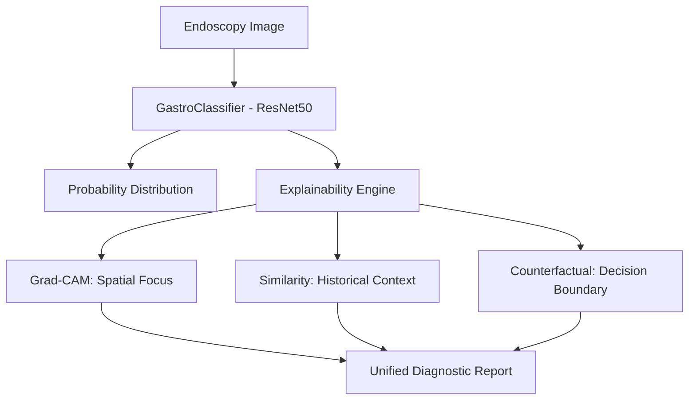

# GastroAI: Multi-Modal XAI for Gastrointestinal Disease Classification

[](https://www.python.org/)
[](https://pytorch.org/)
[](https://streamlit.io/)
[](LICENSE)

GastroAI is a production-grade Explainable AI (XAI) suite designed to assist medical professionals in classifying gastrointestinal pathologies from endoscopy images. Built on the **Kvasir v2** dataset, it combines high-accuracy deep learning with multi-modal explanations to bridge the gap between AI and clinical trust.

**🔗 [Live Demo on Render](https://gastro-xai.onrender.com)**  
*(Note: Initial load may take ~50s on free instances due to cold starts)*

---

## 🔬 Core Features

### 1. Advanced Classification 
- **Backbone**: ResNet50 (Transfer Learning)
- **Dataset**: Kvasir v2 (8 classes including Polyps, Ulcerative Colitis, and Esophagitis)
- **Performance**: High-precision triage with automated uncertainty scoring.

### 2. Multi-Modal XAI Suite
To ensure clinical accountability, the system provides three distinct layers of explanation:
- **🔍 Visual Attention (Grad-CAM)**: Pixel-level heatmaps highlighting regions of interest (e.g., identifying the exact boundaries of a polyp).
- **📚 Historical Case Matching**: Retrieval of biopsy-confirmed similar cases using deep feature embeddings (KNN search).
- **🔄 Differential Analysis (Counterfactuals)**: Generative perturbations that show the minimal visual change required to flip a diagnosis, helping identify borderline features.

### 3. Integrated Diagnostic Assistant
A polished **Streamlit-based dashboard** optimized for clinical use, featuring:
- Real-time image analysis.
- Interactive Plotly visualizations for probability distributions.
- Performance metrics (Inference time, Reliability score).

---

## 🛠️ System Architecture



---

## 🚀 Getting Started

### Prerequisites
- Python 3.8+
- CPU/GPU (optimized for CPU-only environments as well)

### Installation
1. Clone the repository:
   ```bash
   git clone https://github.com/sarthakpapneja/Gastro-XAI.git
   cd Gastro-XAI
   ```

2. Install dependencies:
   ```bash
   pip install -r requirements.txt
   ```

3. Download the Kvasir v2 dataset:
   ```bash
   python utils/download_data.py
   ```

4. Train the model (Optional - best weights provided):
   ```bash
   python train.py
   ```

### Running the App
Launch the interactive dashboard:
```bash
streamlit run app.py
```

---

## 📂 Project Structure

- `app.py`: Main Streamlit application.
- `xai/`: Implementations of Grad-CAM, Similarity Search, and Counterfactuals.
- `models/`: Classifier architecture and weight management.
- `data/`: Custom dataset loaders and augmentation pipelines.
- `utils/`: Data download and preprocessing scripts.

---

## ⚖️ Disclaimer
This software is intended for **research and educational purposes only**. It is not a medical device and should not be used as the sole basis for clinical decisions. Final diagnoses must always be performed by board-certified medical professionals.

---

## 📄 License
This project is licensed under the MIT License - see the [LICENSE](LICENSE) file for details.
